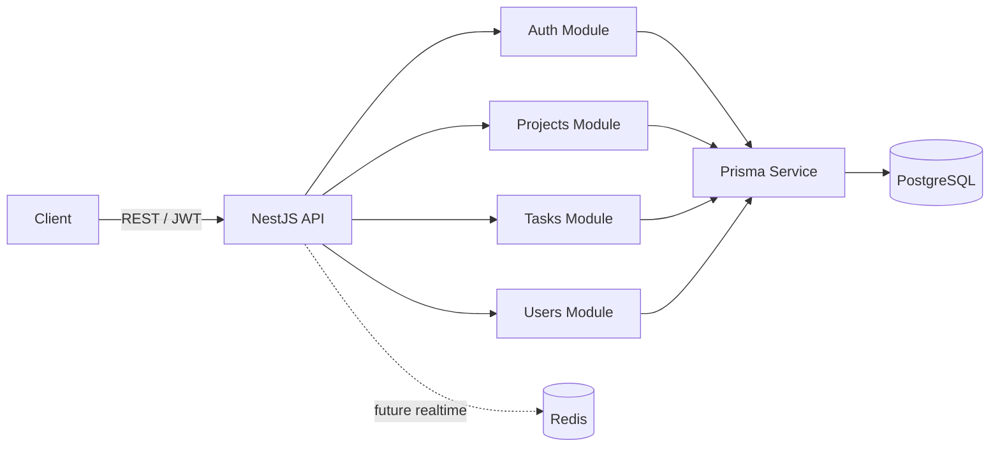

# TaskFlow

Monorepo for a SaaS-style project management platform with a production-focused NestJS backend and a Next.js frontend workspace.

## Current Status

- Backend core is implemented and tested:
  - JWT auth with refresh rotation (`jti` hash storage)
  - RBAC for projects, members, tasks, assignment
  - Audit logs for business-significant actions
  - Request correlation (`x-request-id`) with context metadata
  - Unified exception format
  - Strict request validation
  - Pagination/filter/sort contracts for list endpoints (`items` + `meta`)
- CI is configured via GitHub Actions (lint, typecheck, unit quality gates, build, e2e).
- Frontend product layer is the next major phase.

## Monorepo Structure

```text
apps/
  api/        NestJS + Prisma + PostgreSQL
  web/        Next.js (App Router)
packages/
  ui/         Shared UI primitives
  eslint-config/
  typescript-config/
```

## Architecture (Backend)



## Demo Credentials

Seed script creates these users (password for all: `123456`):

- `admin@test.com` (ADMIN)
- `user1@test.com` (USER)
- `user2@test.com` (USER)

## Quick Start (Local)

### 1. Install dependencies

```bash
pnpm install
```

### 2. Start infrastructure

```bash
docker compose up -d
```

### 3. Configure backend env

```bash
cp apps/api/.env.example apps/api/.env
```

### 4. Apply migrations + seed

```bash
pnpm --filter api exec prisma migrate deploy
pnpm --filter api exec prisma db seed
```

### 5. Run backend

```bash
pnpm --filter api run dev
```

API base URL: `http://localhost:3001/api`  
Swagger: `http://localhost:3001/api/docs`

## Quality Commands

From repo root:

```bash
pnpm lint
pnpm check-types
pnpm build
pnpm --filter api run test:quality
pnpm --filter api run test:e2e:ci
```

## CI

Workflow: `.github/workflows/ci.yml`

- `quality` job: lint + typecheck + unit quality gates + build
- `e2e` job: postgres/redis services + prisma migrate + e2e

## Backend API Notes

List endpoints now return:

```json
{
  "items": [],
  "meta": {
    "page": 1,
    "limit": 20,
    "total": 0,
    "totalPages": 1
  }
}
```

Supported on key endpoints:

- `GET /api/projects`
- `GET /api/projects/:projectId/members`
- `GET /api/projects/:projectId/tasks`
- `GET /api/audit-logs` (ADMIN only)
