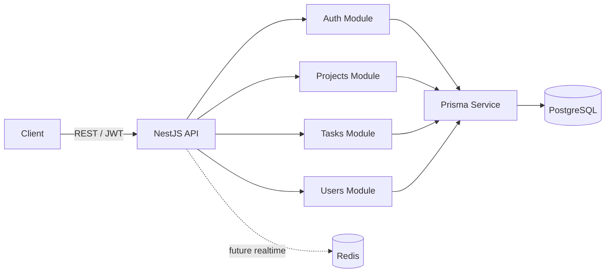

# TaskFlow

Monorepo for a SaaS-style project management platform with a production-focused NestJS backend and a Next.js frontend workspace.

## Current Status

- Backend core is implemented and tested:
  - JWT auth with refresh rotation (`jti` hash storage)
  - RBAC for projects, members, tasks, assignment
  - Audit logs for business-significant actions
  - Request correlation (`x-request-id`) with context metadata
  - Unified exception format
  - Strict request validation
  - Pagination/filter/sort contracts for list endpoints (`items` + `meta`)
- CI is configured via GitHub Actions (lint, typecheck, unit quality gates, build, e2e).
- Frontend product layer is the next major phase.

## Monorepo Structure

```text
apps/
  api/        NestJS + Prisma + PostgreSQL
  web/        Next.js (App Router)
packages/
  ui/         Shared UI primitives
  eslint-config/
  typescript-config/
```

## Architecture (Backend)



## Demo Credentials

Seed script creates these users (password for all: `123456`):

- `admin@test.com` (ADMIN)
- `user1@test.com` (USER)
- `user2@test.com` (USER)

## One-Command Local Start

If Docker, Node 18+, and `pnpm` are already installed on the machine, a new contributor can bootstrap the full local stack with one command from the repo root:

```bash
pnpm setup:dev
```

What it does:

- creates `apps/api/.env` and `apps/web/.env` from the example files if they do not exist
- installs workspace dependencies
- starts PostgreSQL and Redis via Docker Compose
- applies Prisma migrations
- seeds the database
- starts the monorepo dev workspace

This command is safe to re-run. Existing `.env` files are left untouched.

## Production Deployment

The repository now includes a production deployment path built around Docker:

- `apps/api/Dockerfile`
- `apps/web/Dockerfile`
- `docker-compose.prod.yml`
- `deploy/nginx.prod.conf`

### Production Quick Start

1. Copy the backend production env file:

```bash
cp apps/api/.env.production.example apps/api/.env.production
```

2. Edit `apps/api/.env.production`:

- replace `JWT_ACCESS_SECRET`
- replace `JWT_REFRESH_SECRET`
- set `CORS_ORIGINS` to your public origin
  - example: `https://taskflow.example.com`
  - for a local production-style smoke test: `http://localhost`

3. Build and start the full stack:

```bash
pnpm prod:up
```

This starts:

- PostgreSQL
- Redis
- NestJS API in production mode
- Next.js web app in production mode
- Nginx reverse proxy on port `80`

The API container runs `prisma migrate deploy` automatically before it starts.

### Public URLs

After startup:

- App: `http://YOUR_SERVER_IP/`
- API: `http://YOUR_SERVER_IP/api`
- Swagger: `http://YOUR_SERVER_IP/api/docs`

### Production Commands

```bash
pnpm prod:up
pnpm prod:logs
pnpm prod:down
```

### Production Notes

- The web build is configured to use same-origin API calls via `/api`, so you do not need a separate frontend production env file for the default Docker deployment.
- `docker-compose.prod.yml` currently uses the default PostgreSQL credentials `taskflow/taskflow` for simplicity. If you change them, update `DATABASE_URL` in `apps/api/.env.production` to match.
- For a public internet deployment, put TLS in front of this stack (or extend the nginx container to serve HTTPS directly).

## Quick Start (Local)

### 1. Install dependencies

```bash
pnpm install
```

### 2. Start infrastructure

```bash
docker compose up -d
```

### 3. Configure backend env

```bash
cp apps/api/.env.example apps/api/.env
```

### 4. Apply migrations + seed

```bash
pnpm --filter api exec prisma migrate deploy
pnpm --filter api exec prisma db seed
```

### 5. Run backend

```bash
pnpm --filter api run dev
```

API base URL: `http://localhost:3001/api`  
Swagger: `http://localhost:3001/api/docs`

## Demo Workflow Simulation

If tests cleared your data and you want a visually rich workspace again, you can recreate a full demo workflow with one command from the repo root:

```bash
pnpm seed:workflow
```

For a much denser, showcase-ready dataset meant for demos, visual reviews, and "selling" the workspace experience:

```bash
pnpm seed:workflow:heavy
```

What this creates:

- 20 demo projects
- ~140+ tasks with mixed statuses and priorities
- multiple managers and users assigned across projects
- roadmap data on a subset of tasks
- audit activity (`PROJECT_CREATE`, `PROJECT_MEMBER_ADD`, `TASK_CREATE`, `TASK_UPDATE`, `TASK_ROADMAP_UPDATE`)

The script is idempotent for its own demo dataset: it removes the previous demo batch and recreates it cleanly.

Heavy profile creates a significantly richer environment:

- 42 projects
- 500+ tasks
- more managers and users
- denser audit activity for notifications, activity, and canvas visualization
- more roadmap-rich tasks for stronger task detail demos

Implementation location:

- `apps/api/scripts/demo-workspace/seed.ts`

Demo credentials after workflow seeding:

- `admin@test.com` / `123456`
- all generated `@demo.local` users also use `123456`

## Quality Commands

From repo root:

```bash
pnpm lint
pnpm check-types
pnpm build
pnpm --filter api run test:quality
pnpm --filter api run test:e2e:ci
```

## CI

Workflow: `.github/workflows/ci.yml`

- `quality` job: lint + typecheck + unit quality gates + build
- `e2e` job: postgres/redis services + prisma migrate + e2e

## Backend API Notes

List endpoints now return:

```json
{
  "items": [],
  "meta": {
    "page": 1,
    "limit": 20,
    "total": 0,
    "totalPages": 1
  }
}
```

Supported on key endpoints:

- `GET /api/projects`
- `GET /api/projects/:projectId/members`
- `GET /api/projects/:projectId/tasks`
- `GET /api/audit-logs` (ADMIN only)
