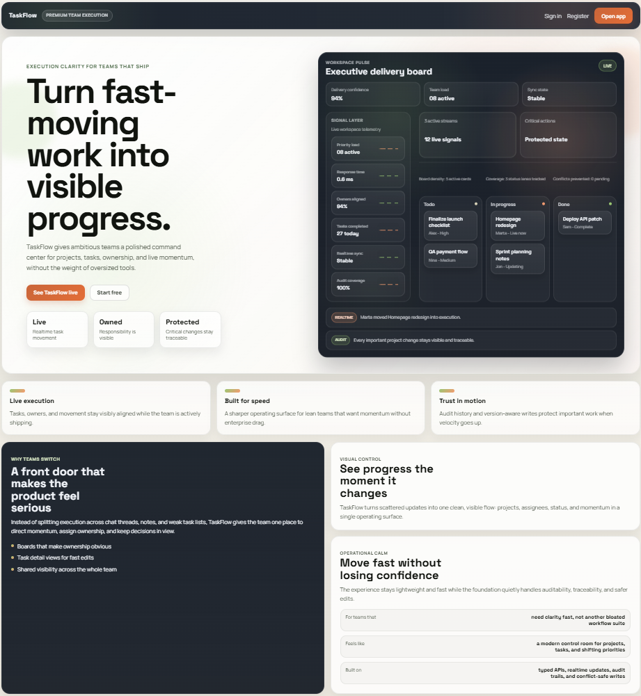
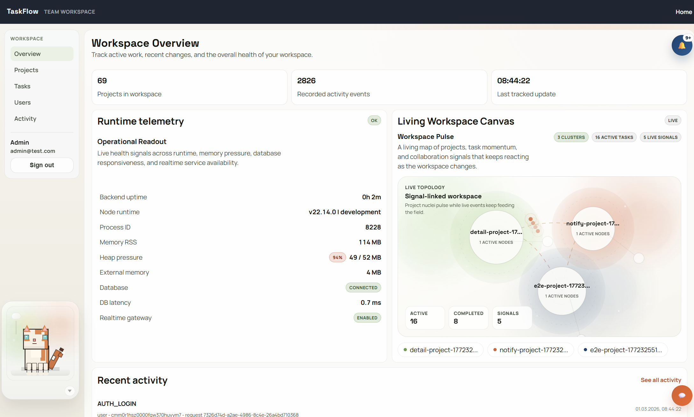
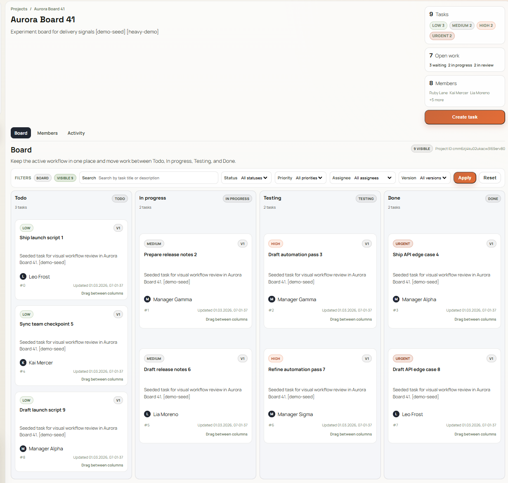
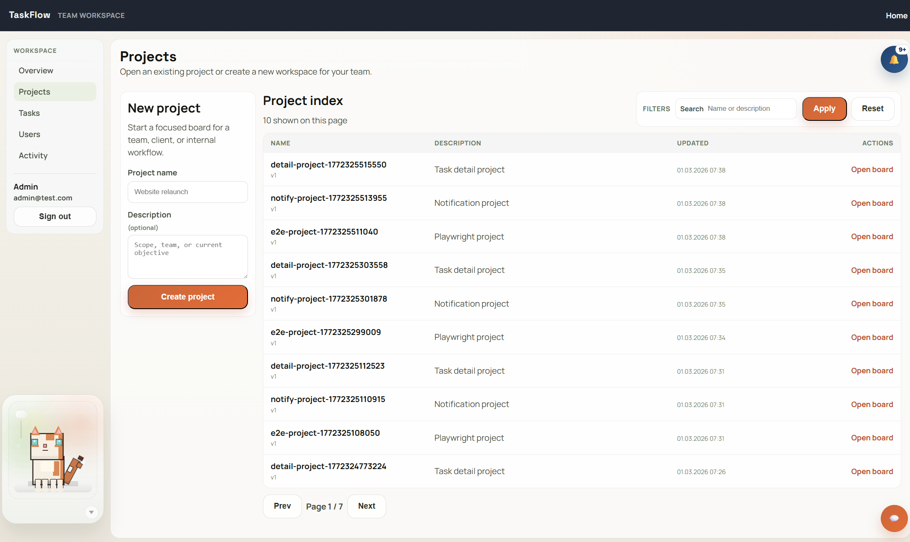
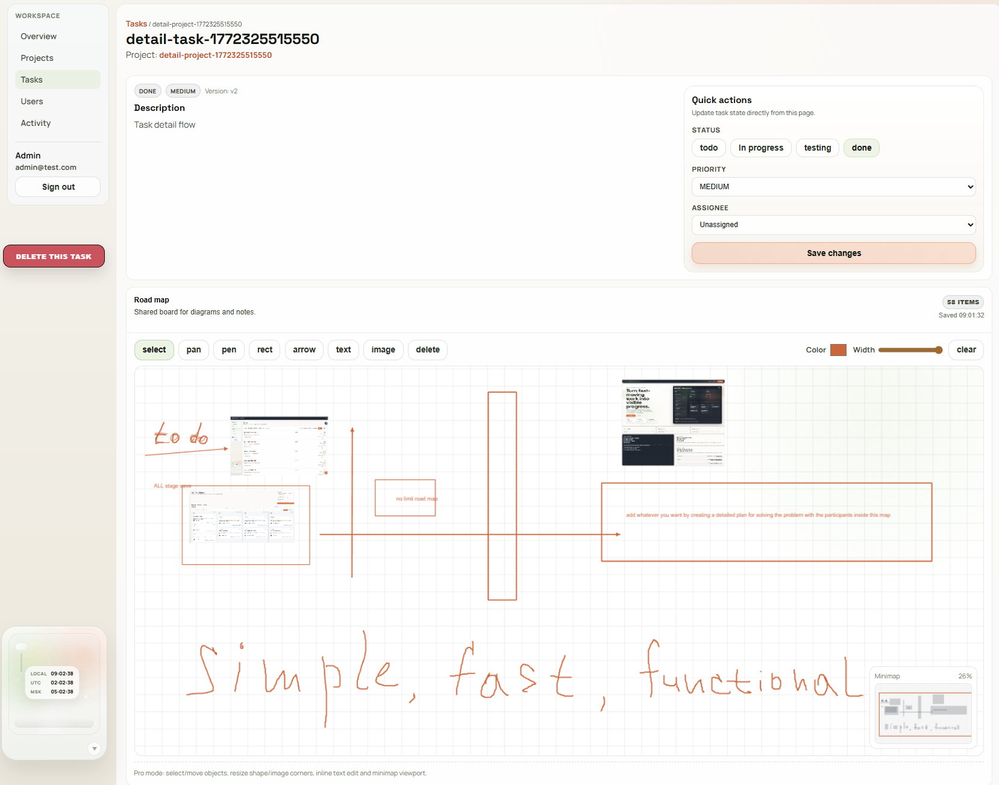
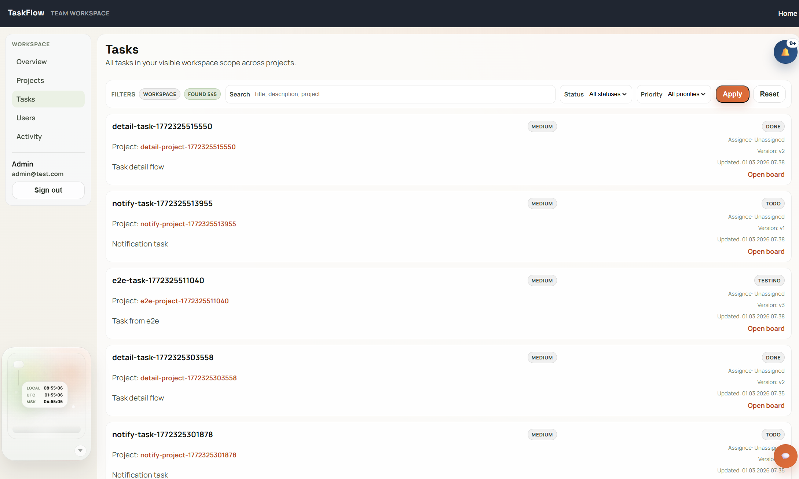
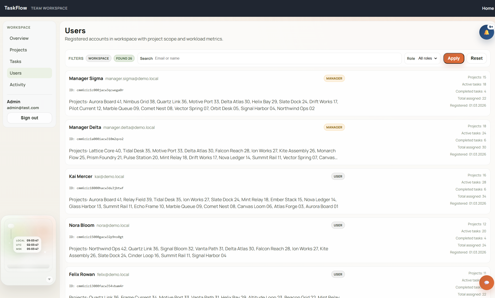
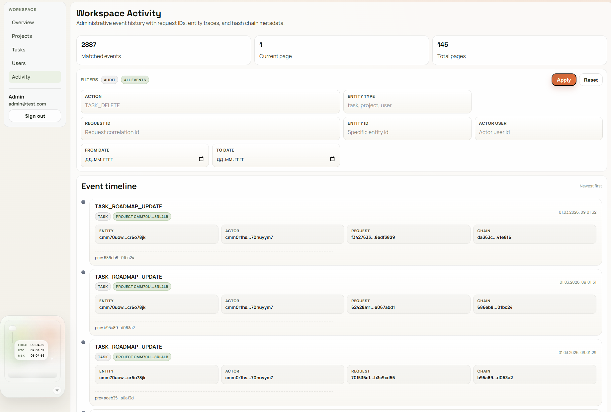
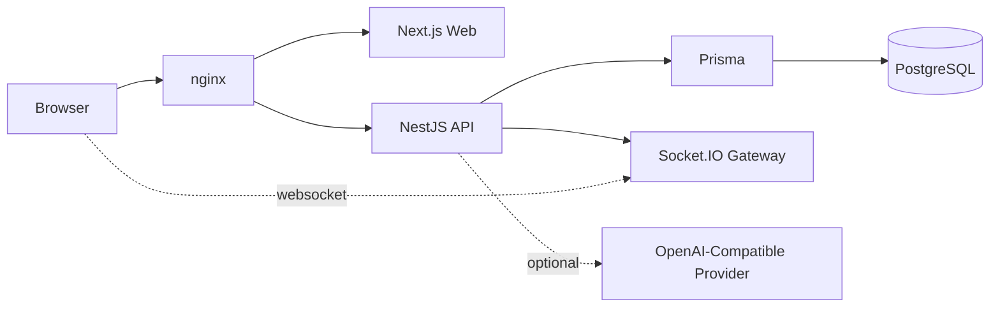

# TaskFlow

Open-source team workspace for projects, tasks, ownership, audit visibility, and realtime progress.


TaskFlow is a full-stack monorepo that combines a production-oriented NestJS API with a polished Next.js and React frontend. It is built to feel like a real product: secure auth, role-aware collaboration, concurrency-safe writes, audit trails, realtime updates, and a premium workspace UI.

## Table of Contents

- [Launch Vision](#launch-vision)
- [What Makes It Strong](#what-makes-it-strong)
- [Highlights](#highlights)
- [Engineering Proof Pack](#engineering-proof-pack)
- [Screenshots](#screenshots)
- [Feature Set](#feature-set)
- [Tech Stack](#tech-stack)
- [Monorepo Structure](#monorepo-structure)
- [Key Architecture](#key-architecture)
- [Quick Start](#quick-start)
- [Demo Accounts](#demo-accounts)
- [Development Commands](#development-commands)
- [Production Deployment](#production-deployment)
- [Testing](#testing)
- [Package Docs](#package-docs)
- [Use Cases](#use-cases)
- [Roadmap](#roadmap)
- [Open-Source Ready](#open-source-ready)
- [Contributing](#contributing)
- [License](#license)
- [Status](#status)

## Launch Vision

TaskFlow is built for teams that move fast and still need structure. It turns scattered updates, task drift, and hidden ownership into one visible operating surface for delivery.

It is a strong fit when you want:

- clear project ownership
- visible task movement
- safe, concurrency-aware updates
- traceable business actions
- fast setup without enterprise bloat

It is designed to work both as:

- a usable internal team tool
- a strong open-source portfolio project
- a production-ready base for a hosted SaaS product

## What Makes It Strong

TaskFlow is not just a CRUD dashboard. It is opinionated around product-grade reliability:

- writes can be retried safely
- stale clients cannot silently overwrite newer data
- important actions stay auditable
- frontend screens are built to feel like a real product, not scaffolding
- the repo already ships with a real production deployment path

## Highlights

- Full-stack monorepo with `NestJS`, `Next.js`, `Prisma`, `PostgreSQL`, and `Socket.IO`
- Premium landing page and polished workspace UI
- JWT auth with refresh rotation
- Role-aware workspace and project permissions
- Project and task management with assignment workflows
- Optimistic concurrency control with `If-Match`
- Idempotent write protection with `Idempotency-Key`
- Hash-chained audit log for critical actions
- Realtime project updates over Socket.IO
- Optional AI assistant mode with zero-cost fallback
- Local one-command bootstrap
- Dockerized production deployment with nginx reverse proxy

## Engineering Proof Pack

This repository is optimized for technical evaluation, not just feature demos.

- CI quality gate: `.github/workflows/ci.yml` runs lint, typecheck, web unit tests, API unit tests, API e2e, and app builds.
- Visual regression pipeline: `.github/workflows/visual-regression.yml` publishes Storybook snapshots to Chromatic on pull requests (when `CHROMATIC_PROJECT_TOKEN` is configured).
- Alerting pack with provisioning: Prometheus + Alertmanager rules for API down, 5xx spikes, p95 latency, failed async jobs, and DB degraded states.
- Load-test profile and benchmark baseline: [`BENCHMARK.md`](./BENCHMARK.md) + `autocannon`/`k6` scripts in `scripts/load`.
- Architecture decision records: [`docs/adr`](./docs/adr/README.md) capturing tenancy, RBAC, idempotency, audit-chain, and observability decisions.
- Security and integrity signal: admin audit-chain verification endpoint `GET /api/admin/audit/verify`.

## Screenshots

Full visual tour of the product surface, from landing to the signed-in workspace.

### Landing

The public front door: brand, product story, and the live product preview that makes the repository feel like a serious application from the first scroll.



### Workspace Overview

The signed-in command surface: runtime telemetry, live workspace canvas, and recent activity in one place.



### Project Board

The core collaboration screen: members, project activity, and a dense board view that keeps active work visible.



### Project Index

Project creation and project discovery in one screen, including search, filters, and quick entry into active boards.



### Task Detail and Roadmap

Detailed task editing plus the roadmap canvas for planning, diagrams, notes, and visual task execution context.



### Workspace Task List

Cross-project task visibility with filtering, version-aware status context, and fast entry back into the relevant board.



### Users Directory

A workspace-wide people view showing role, project scope, and workload signals across the system.



### Audit Timeline

Administrative event history with request tracing, actor visibility, and hash-chain metadata.



## Feature Set

### Product and UX

- Marketing landing page with premium product presentation
- Dedicated auth flow for sign in and registration
- Unified workspace shell with sidebar and topbar navigation
- Responsive, product-style UI rather than starter-template layouts

### Projects and Tasks

- Create and manage projects
- Add, remove, and re-role project members
- Create, list, update, assign, unassign, and delete tasks
- Workspace-wide task views
- Task detail page with roadmap support

### Security and Reliability

- Access + refresh JWT flow
- Refresh token rotation
- Strict validation and throttling
- `helmet` hardening
- Production CORS allow-list
- Optimistic concurrency for safe updates
- Idempotent writes for retry-safe clients

### Visibility and Collaboration

- Workspace overview dashboard
- Realtime project updates via Socket.IO
- Notification and activity views
- Tamper-evident audit records
- Request correlation with `x-request-id`

### Assistant

- Workspace-aware assistant endpoints
- Free `BASIC` mode using internal workspace data
- Optional `LLM` mode through OpenAI-compatible configuration
- Automatic fallback to local mode when provider is unavailable

## Tech Stack

### Backend

- `NestJS 11`
- `TypeScript`
- `Prisma ORM`
- `PostgreSQL`
- `Socket.IO`
- `Swagger / OpenAPI`
- `Jest + Supertest`

### Frontend

- `Next.js 16` (App Router)
- `React 19`
- `TypeScript`
- `socket.io-client`
- `Playwright`

### Infrastructure

- `Docker`
- `Docker Compose`
- `nginx`
- `pnpm`
- `Turborepo`

## Monorepo Structure

```text
apps/
  api/        NestJS backend API
  web/        Next.js frontend app
packages/
  ui/         Shared UI primitives
  eslint-config/
  typescript-config/
deploy/
  nginx.prod.conf
```

## Key Architecture



## Quick Start

### Prerequisites

- `Node.js 18+`
- `pnpm`
- `Docker`

### One-Command Local Bootstrap

From the repository root:

```bash
pnpm setup:dev
```

This command:

- creates missing local env files
- installs dependencies
- starts PostgreSQL and Redis
- applies Prisma migrations
- seeds the database
- starts the full development workspace

This is the fastest way to get a fresh clone into a working state.

### Local URLs

- Web: `http://localhost:3002`
- API: `http://localhost:3001/api`
- Swagger: `http://localhost:3001/api/docs`

## Demo Accounts

Base seed includes:

- `admin@test.com`
- `user1@test.com`
- `user2@test.com`

Password for seeded demo users:

- `123456`

## Development Commands

### Monorepo

- `pnpm dev` - start the full development workspace
- `pnpm build` - build all packages
- `pnpm lint` - run lint across the monorepo
- `pnpm check-types` - run type checks across the monorepo
- `pnpm format` - run Prettier on supported files

### Backend

- `pnpm --filter api dev`
- `pnpm --filter api build`
- `pnpm --filter api start:prod`
- `pnpm --filter api lint`
- `pnpm --filter api test:unit`
- `pnpm --filter api test:quality`
- `pnpm --filter api test:e2e`
- `pnpm --filter api test:e2e:ci`
- `pnpm --filter api seed:workflow`
- `pnpm --filter api seed:workflow:heavy`

### Frontend

- `pnpm --filter web dev`
- `pnpm --filter web build`
- `pnpm --filter web start`
- `pnpm --filter web lint`
- `pnpm --filter web check-types`
- `pnpm --filter web test:unit`
- `pnpm --filter web test:e2e`
- `pnpm --filter web test:e2e:ui`
- `pnpm --filter web storybook`
- `pnpm --filter web storybook:build`
- `pnpm --filter web storybook:test`
- `pnpm --filter web storybook:visual`
- `pnpm --filter web exec playwright install`

## Production Deployment

TaskFlow includes a Dockerized production deployment path out of the box.

Included files:

- `apps/api/Dockerfile`
- `apps/web/Dockerfile`
- `apps/api/.env.production.example`
- `docker-compose.prod.yml`
- `deploy/nginx.prod.conf`

### Production Quick Start

1. Create the backend production env file:

```bash
cp apps/api/.env.production.example apps/api/.env.production
```

2. Edit `apps/api/.env.production` and set:

- `JWT_ACCESS_SECRET`
- `JWT_REFRESH_SECRET`
- `CORS_ORIGINS`
- `INVITE_EMAIL_PROVIDER` (`simulated` or `smtp`)

3. Start the production stack:

```bash
pnpm prod:up
```

This starts:

- PostgreSQL
- Redis
- NestJS API
- Next.js web app
- nginx reverse proxy on port `80`

This means a fresh server can boot the full product stack with one production command after env setup.

### Production URLs

- App: `http://YOUR_SERVER_IP/`
- API: `http://YOUR_SERVER_IP/api`
- Swagger: `http://YOUR_SERVER_IP/api/docs`

### Production Commands

- `pnpm prod:up`
- `pnpm prod:up:tls`
- `pnpm prod:logs`
- `pnpm prod:down`
- `pnpm ops:up`
- `pnpm ops:logs`
- `pnpm ops:down`

### Invitation Email Delivery

Workspace invitation dispatch supports two modes:

- `INVITE_EMAIL_PROVIDER=simulated` (default, audit-only dispatch)
- `INVITE_EMAIL_PROVIDER=smtp` (real email delivery)

SMTP mode variables:

- `INVITE_EMAIL_FROM`
- `INVITE_SMTP_HOST`
- `INVITE_SMTP_PORT`
- `INVITE_SMTP_SECURE`
- `INVITE_SMTP_USER`
- `INVITE_SMTP_PASS`

### TLS Preset

TaskFlow ships with a TLS-ready nginx preset:

- `deploy/nginx.tls.prod.conf`
- `docker-compose.tls.yml`

To use it:

1. Put certificates in `deploy/certs/`:

- `deploy/certs/fullchain.pem`
- `deploy/certs/privkey.pem`

2. Start with TLS override:

```bash
pnpm prod:up:tls
```

### Ops Monitoring Preset

TaskFlow includes a ready-to-run observability stack for production metrics:

- `docker-compose.ops.yml`
- `deploy/monitoring/prometheus/prometheus.yml`
- `deploy/monitoring/grafana/provisioning/*`
- `deploy/monitoring/grafana/dashboards/taskflow-overview.json`

Start monitoring with:

```bash
pnpm ops:up
```

Then open:

- Prometheus: `http://YOUR_SERVER_IP:9090`
- Grafana: `http://YOUR_SERVER_IP:3005` (default `admin` / `admin`)

### Cloud Presets

Starter presets are included in `deploy/cloud`:

- Render blueprint: `deploy/cloud/render/render.yaml`
- Fly.io configs: `deploy/cloud/fly/api.fly.toml`, `deploy/cloud/fly/web.fly.toml`
- Railway baseline: `deploy/cloud/railway/railway.json`
- Usage guide: `deploy/cloud/README.md`

## Testing

### Backend

- Unit tests for services and controllers
- E2E coverage for core API workflows
- Coverage thresholds on critical backend modules

### Frontend

- Playwright end-to-end tests for real user flows
- Navigation and key app paths tested through the browser layer
- Vitest unit/component tests for critical UI and integration components
- Storybook component isolation and Chromatic visual regression workflow

### CI Quality Gate

Every push/PR is verified by pipeline stages in `.github/workflows/ci.yml`:

- quality: lint + typecheck + unit tests + build
- e2e: Prisma migrate deploy + API end-to-end regression suite

## Package Docs

For package-specific technical references:

- Backend doc: [apps/api/README.md](./apps/api/README.md)
- Frontend doc: [apps/web/README.md](./apps/web/README.md)
- ADR index: [docs/adr/README.md](./docs/adr/README.md)
- Benchmark baseline: [BENCHMARK.md](./BENCHMARK.md)

## Use Cases

TaskFlow is a strong base for:

- internal team workspaces
- startup MVPs for project management
- portfolio-grade full-stack architecture showcases
- open-source experimentation with auth, concurrency, auditability, and realtime collaboration

## Roadmap

Latest completed roadmap milestones:

- richer notification center with read/unread state controls
- expanded frontend unit/component test coverage
- file attachments for tasks and projects
- invitation flows by email (SMTP mode + cloud deployment presets)
- deeper assistant workflows and project summaries
- deployment presets for TLS and cloud hosting
- metrics and health dashboards for ops visibility
- alerting pack with provisioned Prometheus + Alertmanager rules
- load test profile (`autocannon` + `k6`) and benchmark report baseline
- Storybook setup with visual regression workflow (Chromatic)
- architecture decision records (`docs/adr`)
- full CI quality gate on PRs (quality + e2e split pipeline)

Potential next iterations:

- provider integrations beyond SMTP (SES/Resend/Postmark)
- advanced operational dashboards with SLO- and error-budget views
- cloud presets for additional targets and managed services
- coverage reporting badges and historical benchmark trend tracking

## Contributing

If you want to extend TaskFlow:

1. Fork the repository
2. Run `pnpm setup:dev`
3. Create a feature branch
4. Add tests for behavior changes
5. Open a pull request

Keeping contributions aligned with the current style matters:

- concise, useful comments
- production-minded code paths
- test coverage for critical logic
- no unnecessary boilerplate
