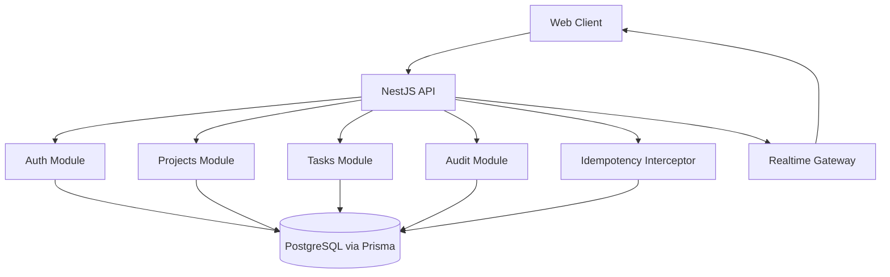

# TaskFlow API

Production-style NestJS backend for collaborative project and task management.

## What This Backend Demonstrates

- clean modular architecture (`auth`, `projects`, `tasks`, `audit`, `realtime`, `idempotency`)
- secure auth with access/refresh JWT and refresh rotation
- granular RBAC for project membership and task operations
- tamper-evident audit trail (hash chain)
- idempotent write operations (`Idempotency-Key`)
- optimistic concurrency control for critical updates/deletes (`If-Match`)
- request correlation (`x-request-id`) across logs/audit entries
- realtime delivery (Socket.IO rooms per project)
- unified API error contract with Prisma error mapping
- tested behavior with unit + e2e suites

## Tech Stack

- `NestJS 11`
- `TypeScript`
- `Prisma ORM`
- `PostgreSQL`
- `JWT` (`passport-jwt`)
- `Socket.IO` (`@nestjs/websockets`)
- `Swagger / OpenAPI`
- `Jest + Supertest`

## Architecture Overview



## Killer Features

### 1. Tamper-evident audit log

Every important business action (project/task/member/auth events) is logged with:

- actor (`actorUserId`)
- action (`PROJECT_CREATE`, `TASK_DELETE`, etc.)
- entity metadata (`entityType`, `entityId`, `projectId`)
- request metadata (`requestId`, `ip`, `userAgent`)
- integrity fields (`prevHash`, `hash`)

`hash` is computed from canonical payload + `prevHash`, forming a chain.
Any mutation of historical records breaks chain consistency.

### 2. Idempotent writes

For `POST/PATCH/DELETE` requests, client can send `Idempotency-Key`.

Behavior:

- same key + same payload -> returns previously stored response (no duplicate side effects)
- same key + different payload -> `409 Conflict`
- same key while request is in progress -> `409 Conflict`

Scope: `(actorUserId, method, path, key)`.

### 3. Optimistic concurrency control

`Project` and `Task` entities include `version`.
Critical `PATCH`/`DELETE` endpoints require `If-Match`.

Behavior:

- missing `If-Match` -> `428 Precondition Required`
- stale `If-Match` -> `412 Precondition Failed`
- successful write -> `version` increments atomically

This prevents lost updates in concurrent editing scenarios.

### 4. Request correlation

Global middleware injects/propagates `x-request-id` per HTTP request.
The same request ID is persisted in audit log records, enabling end-to-end tracing.

### 5. Realtime project events

Socket namespace: `/realtime`, room model: `project:{projectId}`.
Supported room events:

- `project:join`
- `project:leave`

Server emits domain events like:

- `project.created`
- `member.added`
- `member.role_updated`
- `task.created`
- `task.updated`
- `task.deleted`
- `task.assigned`
- `task.unassigned`

## Security and API Hardening

- `helmet` enabled
- CORS policy:
  - permissive in `development/test`
  - strict allow-list in `production` (`CORS_ORIGINS` required)
- global validation:
  - `whitelist: true`
  - `forbidNonWhitelisted: true`
  - `transform: true`
- throttling:
  - global limits (`THROTTLE_*`)
  - stricter auth limits (`AUTH_THROTTLE_*`)
- JWT guard on protected routes
- centralized error format with Prisma code mapping (`P2002`, `P2025`, `P2003`)

## API Surface (high level)

Base prefix: `/api`

- `GET /health`
- `POST /auth/login`
- `POST /auth/refresh`
- `POST /auth/logout`
- `GET /projects`
- `POST /projects`
- `GET /projects/:id`
- `PATCH /projects/:id` (`If-Match` required)
- `DELETE /projects/:id` (`If-Match` required)
- member management:
  - `GET /projects/:projectId/members`
  - `POST /projects/:projectId/members`
  - `PATCH /projects/:projectId/members/:userId`
  - `DELETE /projects/:projectId/members/:userId`
  - `POST /projects/:projectId/leave`
- task management:
  - `GET /projects/:projectId/tasks`
  - `POST /projects/:projectId/tasks`
  - `PATCH /projects/:projectId/tasks/:id` (`If-Match` required)
  - `DELETE /projects/:projectId/tasks/:id` (`If-Match` required)
  - `PATCH /projects/:projectId/tasks/:id/assign`
  - `PATCH /projects/:projectId/tasks/:id/unassign`
- audit:
  - `GET /audit-logs` (ADMIN only)

Full contract: Swagger UI.

## Quick Start

### 1. Configure environment

From `apps/api`:

```bash
cp .env.example .env
```

### 2. Start infrastructure

From repository root:

```bash
docker compose up -d
```

### 3. Apply DB migrations and seed

From `apps/api`:

```bash
pnpm exec prisma migrate deploy
pnpm exec prisma db seed
```

### 4. Start API

From `apps/api`:

```bash
pnpm run dev
```

### 5. Open docs

- Swagger: `http://localhost:3001/api/docs`
- Base URL: `http://localhost:3001/api`

## Environment Variables

| Variable | Required | Purpose |
|---|---|---|
| `NODE_ENV` | no | `development` / `test` / `production` |
| `PORT` | no | HTTP port, default `3001` |
| `DATABASE_URL` | yes | PostgreSQL connection |
| `JWT_ACCESS_SECRET` | yes | access token signing secret (min 16 chars) |
| `JWT_REFRESH_SECRET` | yes | refresh token signing secret (min 16 chars) |
| `CORS_ORIGINS` | prod yes | comma-separated allowed origins in production |
| `THROTTLE_TTL_MS` | no | global throttling window |
| `THROTTLE_LIMIT` | no | global request limit per window |
| `AUTH_THROTTLE_TTL_MS` | no | auth throttling window |
| `AUTH_THROTTLE_LIMIT` | no | auth request limit per window |

## Contract Examples

### Idempotent project creation

```bash
curl -X POST "http://localhost:3001/api/projects" \
  -H "Authorization: Bearer <access-token>" \
  -H "Content-Type: application/json" \
  -H "Idempotency-Key: proj-create-001" \
  -d '{"name":"Roadmap","description":"Q1 planning"}'
```

Retrying the exact same request with the same key returns the stored response instead of creating duplicates.

### Concurrency-safe task update

```bash
curl -X PATCH "http://localhost:3001/api/projects/<projectId>/tasks/<taskId>" \
  -H "Authorization: Bearer <access-token>" \
  -H "Content-Type: application/json" \
  -H "If-Match: 3" \
  -d '{"status":"DONE"}'
```

If server-side version is not `3`, response is `412 Precondition Failed`.

## Scripts

- `pnpm run dev` - start with watch mode
- `pnpm run build` - compile application
- `pnpm run lint` - run ESLint (with autofix)
- `pnpm run test:unit` - unit tests
- `pnpm run test:quality` - unit tests + coverage thresholds
- `pnpm run test:e2e` - e2e tests
- `pnpm run test:e2e:ci` - e2e tests in-band (CI stable)

## Quality Gates

- strict TypeScript checks
- ESLint + Prettier
- coverage thresholds configured for critical services
- CI workflow includes quality and e2e checks

Latest local verification (backend hardening stage):

- unit suites: `4/4` passed
- e2e suites: `7/7` passed
- tests: `46/46` passed

## Project Structure

```text
apps/api
  prisma/
    migrations/
    schema.prisma
  src/
    auth/
    projects/
    tasks/
    audit/
    realtime/
    idempotency/
    common/
    config/
    prisma/
  test/
```

## Notes

- this README intentionally focuses on backend capabilities only
- repository-level README can be finalized later after frontend completion
